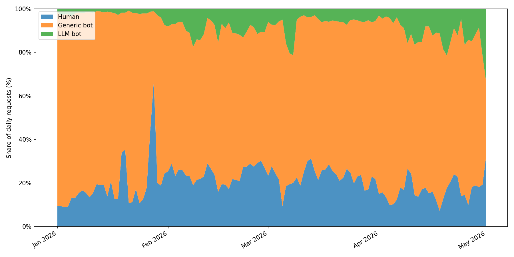
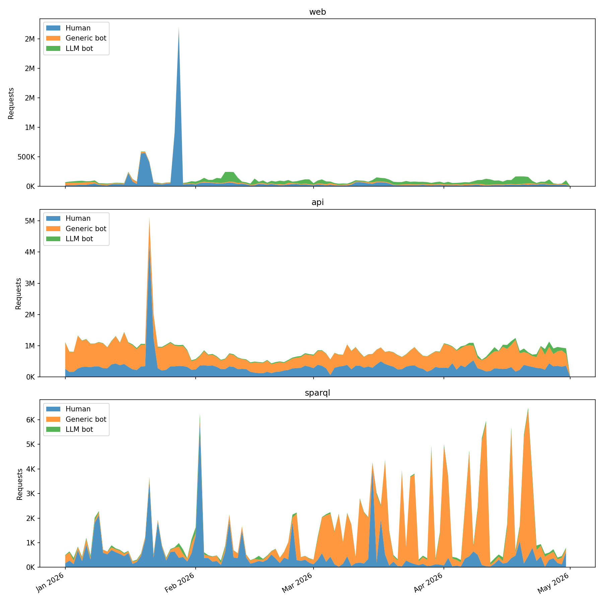
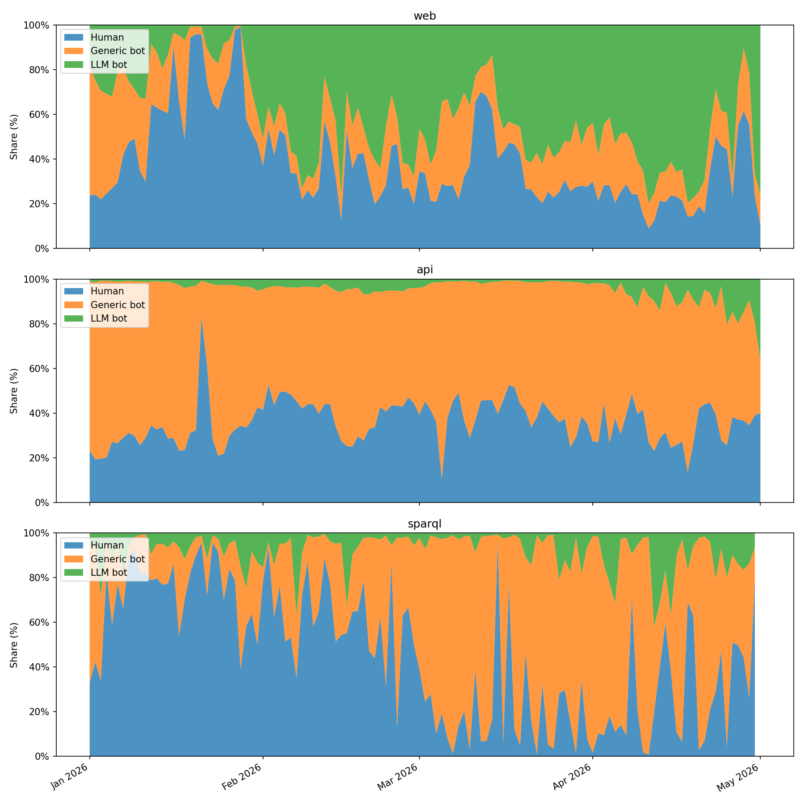

# oc-botwatch

[](https://github.com/arcangelo7/oc-botwatch/actions/workflows/test.yml)
[](https://arcangelo7.github.io/oc-botwatch/coverage/)

Classifies traffic from [OpenCitations](https://opencitations.net) server access logs into three categories (human visitors, generic bots, LLM bots) and three services (web, API, SPARQL).

It reads monthly CSV dumps, looks at each request's user-agent, host, and path, and outputs `daily_traffic.csv` with per-day totals by category plus `daily_traffic_by_service.csv` with the same counts broken down by service.

## Input data

The script reads all `.csv` files from the `input/` directory. Each file is a monthly export of OpenCitations HTTP access logs; the `date`, `user_agent`, `request_host`, `request_path`, `request_method`, and `http_response_code` columns are used. 

The source data is published on Zenodo ([doi:10.5281/zenodo.20289873](https://doi.org/10.5281/zenodo.20289873)). To reproduce the results, download and extract the archive into `input/`.

## How classification works

The rule we follow is simple: a request only counts as a bot when its user-agent identifies it as one of the well-known crawlers. Nothing else. We match the user-agent against three public lists, included as git submodules:

- [ai.robots.txt](https://github.com/ai-robots-txt/ai.robots.txt)
- [crawler-user-agents](https://github.com/monperrus/crawler-user-agents)
- [COUNTER-Robots](https://github.com/atmire/COUNTER-Robots)

If the user-agent matches an entry in ai.robots.txt, the request is an `llm_bot`. The two names "Spider" and "Code" are skipped because they're too generic and would match strings that have nothing to do with LLM crawlers. If instead it matches crawler-user-agents (minus the entries already tagged `ai-crawler`) or COUNTER-Robots, it's a `generic_bot`. A handful of crawlers turn up in our logs but aren't in any of those three lists, so we keep an extra file for them:

- [`supplementary_bots.txt`](supplementary_bots.txt)

Everything else is `human`. That covers the obvious case of a person browsing the site, but it also covers the less obvious cases on purpose: somebody hitting our API from a Python script, a curl command in a shell loop, a researcher pulling data with a homemade scraper. None of those count as bots here.

### Why these three sources

Because they have already been adopted in the literature. In particular, [Liu et al. (2025)](https://doi.org/10.1145/3730567.3732913) uses Dark Visitors, the upstream data source of ai.robots.txt, as its primary reference for compiling LLM user agents, and relies on crawler-user-agents as a supplementary corpus of general-purpose bot signatures when testing the coverage of Cloudflare's bot-blocking feature. 

COUNTER-Robots is the robot list maintained by [Project COUNTER](https://www.projectcounter.org), an international initiative that sets standards for counting usage of electronic scholarly resources. Since OpenCitations is itself a scholarly infrastructure, filtering its logs with COUNTER-Robots aligns with the conventions of the domain.

## Service classification

Each request is also assigned to one of three services, based on `request_host`, `request_path`, and `request_method`. Redirects (3xx) are dropped from the dataset entirely: they come from deprecated API paths (e.g. `/index/coci/api/v1/`) or from the main domain bouncing requests to a subdomain, and the actual response appears as a separate log entry on the destination host.

- `sparql`: any non-redirect request whose path matches `/sparql`, or a request to `sparql.opencitations.net` that carries a `?query=` parameter or uses the POST method.
- `api`: any non-redirect request whose path matches a versioned API route with at least one segment after the version number: `/index/v\d+/…`, `/index/api/v\d+/…`, `/meta/v\d+/…`, `/meta/api/v\d+/…`. Bare version roots (`/index/v1`, `/meta/v1`) and non-API paths on `api.opencitations.net` (`/robots.txt`, `/`) fall through to `web`. The INDEX and META REST endpoints are grouped together under `api`.
- `web`: everything else. The main site (`opencitations.net/`, `/about`, `/governance`, ...), subdomains such as `ldd.opencitations.net`, `search.opencitations.net`, `download.opencitations.net`, `statistics.opencitations.net`, `oci.opencitations.net`, and `sparontologies.net`, and non-service requests on `sparql.opencitations.net` and `api.opencitations.net` (static assets, robots.txt, UI pages).

## Findings

The dataset covers January through April 2026. The `output/` directory contains `daily_traffic.csv` (per-day counts by category), `daily_traffic_by_service.csv` (per-day counts by category and service), and four stacked area charts.




Human traffic sits between 32% and 45% of monthly requests. Generic bots take 48% to 55%. LLM bots go from 2% in January to 13% in April, or 1.06M to 4.09M monthly requests (+287%).

### By service





The bulk of LLM bot traffic targets the web front end. Over the four months, LLM crawlers make up 31.5% of web requests: nearly one in three. On the API and SPARQL endpoints they barely register, hovering around 4%, while generic bots dominate both (58.7% and 61.3%).

| Service | Human | Generic bot | LLM bot |
|---|---|---|---|
| web | 56.0% | 12.5% | 31.5% |
| api | 37.4% | 58.7% | 3.9% |
| sparql | 34.6% | 61.3% | 4.1% |

The growth from 2% to 13% is therefore almost entirely on the browsable site. LLM crawlers are not querying the REST API or the SPARQL endpoint in any significant volume.

## Limitations

We only catch bots that openly identify themselves through the user-agent. Anything that spoofs a browser string, or uses a custom user-agent that doesn't appear in the three lists, is going to land in the human bucket. So in practice the bot counts are a lower bound and the human counts an upper bound. The numbers still work well for tracking how the relative shares move over time, since the same rules are applied across the whole dataset.

## Running

Requires Python 3.10+ and [uv](https://docs.astral.sh/uv/).

```
uv sync
uv run python -m oc_botwatch.classify
uv run python -m oc_botwatch.visualize
```

## Tests

```
uv sync --dev
uv run pytest
```

