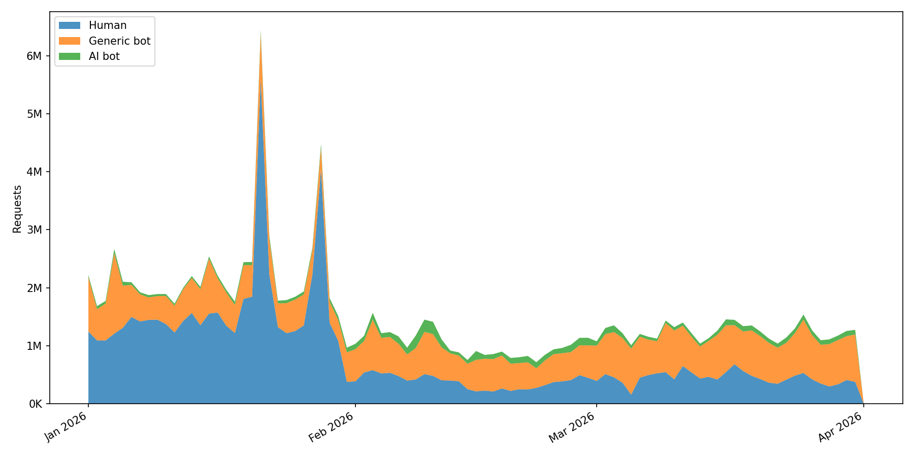

# oc-botwatch

Classifies traffic from [OpenCitations](https://opencitations.net) server access logs into three categories: human visitors, generic bots, and LLM bots

It reads monthly CSV dumps, classifies each request by its user-agent string, and outputs a single `daily_traffic.csv` with per-day counts for each category.

## Input data

The script reads all `.csv` files from the `input/` directory. Each file is a monthly export of OpenCitations HTTP access logs; only the `user_agent` and `date` columns are used. The datasets are not yet publicly available but will be released in the future.

## How classification works

User-agent strings are matched against three open databases (included as git submodules):

- [ai.robots.txt](https://github.com/ai-robots-txt/ai.robots.txt)
- [crawler-user-agents](https://github.com/monperrus/crawler-user-agents)
- [COUNTER-Robots](https://github.com/atmire/COUNTER-Robots)

A request is labeled `ai_bot` if its user-agent matches any entry in ai.robots.txt. Otherwise, if it matches crawler-user-agents (excluding entries already tagged as `ai-crawler`) or COUNTER-Robots, it's labeled `generic_bot`. Everything else is `human`.

### Why these three sources

Because they have already been adopted in the literature. In particular, [Liu et al. (2025)](https://doi.org/10.1145/3730567.3732913) uses Dark Visitors, the upstream data source of ai.robots.txt, as its primary reference for compiling AI user agents, and relies on crawler-user-agents as a supplementary corpus of general-purpose bot signatures when testing the coverage of Cloudflare's bot-blocking feature. 

COUNTER-Robots is the robot list maintained by [Project COUNTER](https://www.projectcounter.org), an international initiative that sets standards for counting usage of electronic scholarly resources. Since OpenCitations is itself a scholarly infrastructure, filtering its logs with COUNTER-Robots aligns with the conventions of the domain.

## Limitations

User-agent string matching only detects bots that openly identify themselves. In practice, this means that the bot counts produced here are a lower bound on actual bot traffic, and the human counts are an upper bound. The classification remains useful for tracking relative trends over time, since the same lists applied consistently yield comparable proportions across periods.

## Running

Requires Python 3.13+ and [uv](https://docs.astral.sh/uv/).

```
uv sync
uv run python -m oc_botwatch.classify
uv run python -m oc_botwatch.visualize
```

## Output

Both files are in the `output/` directory.

`output/daily_traffic.csv`: per-day request counts by category.

```csv
date,human,generic_bot,ai_bot
2026-01-01,150432,28901,4210
2026-01-02,148877,27650,4455
...
```

`output/daily_traffic.png`: stacked area chart of daily traffic.


